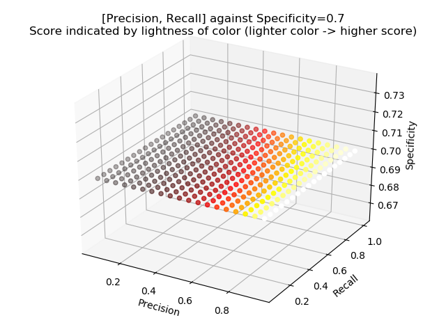

# Statistically Classifying Tandem Repeats Within the Human Genome
Project lead: Gary Benson\
Primary contributor: Michael Korovkin

***
#### Abstract

Tandem repeats are adjacent, repeated sequences in human DNA. They contribute to a
variety of factors having to do with gene expression having to do with human
morphological conditions. Each tandem repeat is defined by its numerical starting
and ending position within the human genome, as well as its "copy number" (number
of the copies of the given repeated DNA sequence). The "genotype" of an observed
tandem repeat is defined by its copy number, reletive to its expected copy number.
For example, a tandem repeat of genotype 0/0 would have a copy number identical to
its expected copy number. A tandem repeat of genotype 0/1 would have a copy number
which is larger by one half of a copy. A tandem repeat of genotype 1/1 would have
a copy number which is larger than its reference copy number by one copy. The
inverse applies to genotypes 0/-1 and -1/-1.

This investigation was focused on developing a process to identify the genotype
of large tandem repeats (> 1000 base pairs) through DNA read data. A dataset for
each read length 100, 148, and 250 base pairs was assembled through a boostrapping
method, based on real human genome data. The dataset contained data for each
tandem repeat, specificying the following variables: tandem repeat ID, starting
index, ending index, array length, number of read mappings inside the repeat's
array, number of mappings on either flank sequence of the repeat's array, the
copy number, and the repeat's pattern size. Seven real-life human DNA datasets
were also used later in the experiment.

The experiment's first step was to identify a trend between array length and the
ratio of reads mapping inside the array, divided by the sum of the read mapings
onto the repeat's flanks. For each read length, these relationships were
established to be linear. Next, machine learning methods were implemented in order
to classify tandem repeats as being either 0/0 or not 0/0. The methods
investigated included: linear regression classification, k nearest neighbors,
gradient boosted decision tree classification, and support vector machine
classification. While classification accuracy was deemed to be important, false
classification of 0/0 sequences as non-0/0 sequences was given great significance
as well; thus, a balance between the two scores was found in the search for
optimal classifiers.

The most robust classification method was found to be a customized linear support
vector classifier (with inputs of ratio and array length), with an alterred loss
function which penalized false-positive classifications more so than false-negative
classifications. This method yielded a precision of 0.95, a recall of 0.78, a
specificity of 0.98, and a Matthew Correlation Coefficient of 0.78; the false
positive rate was 0.02 and the false negative rate was 0.22. Further methods,
including logistic regression and kernel support vector classifiers, are currently
being investigated in order to further minimize the false positive and false
negative rates.

***
#### Project Prompts
1. How different must "critical ratios" (read count inside array divided by read
count on flanks) be in order to statistically conclude whether the tandem repeat's
overall array length changed across two samples?
2. Can the length of a given tandem repeat array be predicted from ratio data?
3. Can the copy number of a tandem repeat be determined from a ratio and a pattern
length?
4. Can the genotype of a tandem repeat, given its respective human genome data, be
identified?

***
#### File Summary
```graph_color2.py```\
File useful for exploratory analysis and data visualization. Uses Plotly to display
data and allow easy manipulation and scrolling. Displays many different aspects of
the data.

```graph_color2_driver```\
Driver for <i>graph_color2.py</i>.

```simulator6.py```\
Simulates a read-mapping experiment on the human genome, using statistics emulative
of actual human genome data. Provides graphical representations of the results.

***
#### Exploratory & Preliminary Work
1. A simulator was built to emulate the experimental sequencing of the human genome
in order to obtain a simulated result of "critical mapping ratios" (calculated by
dividing the read count inside a given array region by the read count on its two
respective flanks)
2. This simulator was used to obtain expected data for the 0/0 genotype of an
arbitrary tandem-repeat-linked gene, given the expected mapping data of the gene
3. the expected data was used to calculate expected standard deviations of the
critical ratios observed at each gene array length, as well as the expected value
of the critical ratio
4. Ideal linear regression models for 0/0 genotypes were calculated from the
expected data
5. A statistical method of prediction was built to predict the read length
associated with a certain human genome dataset; the algorithm functioned with
approximately 44%

***
#### Results & Points
1. More data would be helpful, since (as seen on the simulator) simple standard
deviation-based classification of points is not robust; there is too much noise
in the data to classify things using standard statistical methods

***
#### Conclusions
1. Problem 1 was solved through the aforementioned simulation in
```simulator6.py```
    * In summary, it was found that ratios of the same read length, corresponding
    to the same tandem repeat, must differ by more than <i>twice</i> the quantity
    ```(1.96 * standard deviation)```, where the standard deviation is obtained
    from the simulations executed in ```simulator6.py```
2. Problem 2 is relatively simple to solve if flank intersection counts for a given
tandem repeat are known; in this case, an elementary algebraic equation must be
solved in order to predict the array length of the repeat
    * If flanks are not known, but the genome/area coverage is known, then a linear
    regression model can be used to predict the array length since the flank counts
    can be approximated using the genome coverage
3. Problem 3 was straightforward to solve, since the pattern length is directly
related to the copy number of the tandem repeat
    * Knowing the pattern length and the ratio of the tandem repeat can yield an
    accurate estimation of the tandem repeat's copy number
    * if the pattern length is not known, then estimating the copy number requires
    knowledge of the given tandem repeat's genotype
    
***
#### Future Developments
1. Problem 4 will be addressed using a set of classifiers (SVM, Bayesian decision
tree, random forest); the performance and consistency of each one will be
investigated
    * The data will also be screened under statistical tests such as Chi-squared
    and F, in hopes of capturing differences in overall dataset variance

***
#### Current Work

Notable conditions of data:\
1. flanks are kept constant, equal to their mean across the 0/0 genotype dataset of a simulated dataset
2. array lengths above 5000 are dropped
3. indistinguishable TRIDs are dropped

In addressing the problem of classifying genotypes, 7 different classification algorithms were investigated. Optimally-performing ones are discussed below.

#### Raw Classification Results

| Metric | RandomForestRegressor | SupportVectorClassifier | GaussianProcessRegressor | BaggingClassifier | GradientBoostingClassifier | GradientBoostingRegressor | Multiple Linear Regression | Definition |
|---|---|---|---|---|---|---|---|---|
| Precision        | 0.513 | 0.815 | 0.513 | 0.564 | 0.724 | 0.733 | 0.967 | TP / (TP + FP), rate of true positives out of all positives |
| Recall           | 0.651 | 0.516 | 0.609 | 0.630 | 0.583 | 0.588 | 0.503 | TP / (TP + FN), true positive rate |
| Specificity      | 0.794 | 0.920 | 0.759 | 0.830 | 0.951 | 0.955 | 0.989 | TN / (TN + FP), true negative rate |
| False Pos. Rate  | 0.349 | 0.484 | 0.391 | 0.370 | 0.417 | 0.419 | 0.497 | 1 - recall |
| False Neg. Rate  | 0.206 | 0.080 | 0.240 | 0.172 | 0.048 | 0.044 | 0.011 | 1 - specificity |
| F1-score         | 0.574 | **0.632** | 0.556 | 0.595 | **0.646** | **0.647** | **0.661** | harmonic mean of precision and recall; [worst=0, best=1] |

Notes:\
* For context: what fraction of non-0/0 are classified as non-0/0 **(true positive)**
* For context: what fraction of those classified as non-0/0 are, in fact, 0/0 **(false  positive)**

For reducing the rate of *false positives*, useful classifiers:\
* SupportVectorClassifier
* GradientBoostingClassifier
* GradientBoostingRegressor
* Multiple Linear Regression

#### Classifier Overview

| Cost/Benefit | Support Vectors                            | Gradient Boosting        | Linear Regression                                                 |
|--------------|--------------------------------------------|--------------------------|-------------------------------------------------------------------|
| Cost         | Better for unbalanced data                 | Better for discrete data | Constrained in its potential (captures only linear relationships) |
| Benefit      | Can find linear separation (almost always) | Very robust performance  | Versatile and easy-to-understand                                  |

#### Summary - Part 1 - Simulator

Samples of read data from the human genome were simulated at various read lengths and array lengths in an attempt to
identify a trend in the relationship between ratios and read array lengths. This experiment was supposed to demonstrate
the required difference in array length, between two sequences, in order to conclude that the two sequences are
statistically different in length.

The simulations were primarily performed such that array lengths were normally distributed ~ N(550, 150), with each
flank being held constant at half of the read length. The results showed that there was a positive linear relationship
between the ratio of a tandem repeat and its array length. Likewise, there was a positive linear relationship between
array length and the difference in ratio required to conclude that two tandem repeats are of distinct array lengths.

Key notes:
1. For the simulations, flanks and array lengths were randomized to create noise in the data
2. The ratio investigated was calculated as (number reads mapping inside array) / (number reads crossing flanks)
3. A read was determined to cross a flank if it was was more than 25%-of-read-length inside the array length, and more
than 25%-of-read-length out of the array
4. Simulator results were in the format of a graph, showing the relationship between ratio and array length, surrounded
by 95%-confidence-interval error bars

#### Summary - Part 2 - PlotLy Graphs

Graphs using the PlotLy library, demonstrating the relationship between tandem repeat ratios and their array lengths
using data simulated/reconstructed from real tandem repeat data, were constructed in order to illustrate the true
relationship between ratios and array lengths. These were compared to the simulated regression lines and data in order
to determine the usability and relevance of the aforementioned simulations.

While the simulated genome data tended to adhere relatively accurately to the simulations, a key finding of the
investigation was that it seemed difficult to separate the various degrees of genotypes for each tandem repeat. There
seemed to be significant overlap in the genotypes 0/0, 0/1, and 0/-1, as well as significant overlap between the
genotypes of 0/1 and 1/1, and 0/-1, and -1/-1. This finding was used to motivate the next part of the project.

Key notes:
1. Flanks were held constant at their mean values
2. The graphs contained regression lines for each of the various TR genotypes present in the sample data (e.g. -1/-1,
0/-1, 0/0, 0/1, 1/1)
3. The graphs contained an estimated regression line from the previous simulations with standard deviation lines around
it to help capture the difference between simulated trends and observed-simulated data trends
4. It was concluded that tandem repeats with larger pattern lengths were easier to differentiate (in terms of genotype)
5. It was concluded that the simulated trends did not exactly follow the observed-simulated data trends

#### Summary - Part 3 - Classifying Genotypes

Various approaches to classification of genotypes have been tested. The most successful approaches have included:
1. Multiple linear regression models
2. Gradient boosted decision trees
3. Support vector machines

It was determined that SVMs would be the best method of classification. Thus, they are currently being investigated.

Key notes:
1. The classifier was written to first differentiate between 0/0 TR genotypes and 0/1 TR genotypes
2. The SVM classifier was written in bare-bones Tensorflow to allow for maximum customization
3. The SVM loss function was altered to emphasize a lack of false-postive classification
4. Input features were ratio, array length; output was a score of -1 or 1, to indicate a genotype of 0/0 or a genotype
of 0/1
5. Current relevant statistics include:
    1. Recall = 0.0
    2. Specificity = 0.0
    
More detailed notes on SVM processes:
1. Learning rates with differentiable loss explored (0.1 to 0.000000001), using optimizers ```AdamOptimizer```,
```GradientDescentOptimizer```, ```AdagradOptimizer```
2. Learning rates with non-differentiable loss explored (0.1 to 0.00001), using optimizers ```ProximalGradientDescentOptimizer```,
```ProximalAdagradOptimizer```
3. Differentiable loss function: ```(C * error_term) + (false_positive_error * false_positive_penalty) + (error_residuals * alpha) + L2_norm```
4. Parameters altered
    1. Learning rate
    2. Error term penalty (C)
    3. False positive significance modifier (d)
    4. False positive error penalty (d_penalty)
    5. Error residual penalty (alpha)
    6. L2 norm weight (l2_norm)
    7. Type of optimizer
    
*Lowest false-positive training rate achieved was 0.4577*

A method was later used to tune parameters further, past the SVM loss function
using a non-differentiable score criterion: ```(log(recall * precision) / specificity) +
specificity```. This criterion was optimized to a maximum point, which yielded a balance
between precision (percentage of positives which are true positives) and specificity
(inverse of false positive rate). This tuning was done on a subset of the overall training
dataset, which had the following added criteria:
1. Array length is less than 15000
2. Pattern size is greater than 150
3. Left, right flank counts are greater than 0
4. Inside array counts are greater than 0
5. Copy numbers are less than 10

Future steps:
1. Try out different optimizers: ```tf.keras.optimizers.SGD```, ```MomentumOptimizer```
2. Alter parameters and figure out how to specifically account for false positives in loss function
3. Simplify loss function to preserve differentiability

| Method | Precision | Recall | Specificity | FPR | FNR | F-score | TP count | FP count | FN count | TN count | MCC | 
|---|---|---|---|---|---|---|---|---|---|---|---|
|SVC with Korovkin loss function (only test dataset) | 0.9330 | 0.1692 | 0.9748 | 0.0252 | 0.8308 | 0.2864 | 668 | 48 | 3281 | 1857 | 0.2430 |
|SVC with Korovkin loss function (train + test dataset) | 0.9536 | 0.3022 | 0.9697 | 0.0303 | 0.6978 | 0.4590 | 1501 | 73 | 3466 | 2337 | 0.3652 |
|SVC with Korovkin loss function (only train dataset) | 0.9792 | 0.8320 | 0.9644 | 0.0356 | 0.1680 | 0.8996 | 847 | 18 | 171 | 487 | 0.8034 |

#### Korovkin Cost Function


[PlotLy graph for ```READ_LENGTH=100```](https://plot.ly/~mkorovkin/23/read-length100-coverage1420-array-lengths-from-3005000/#/)